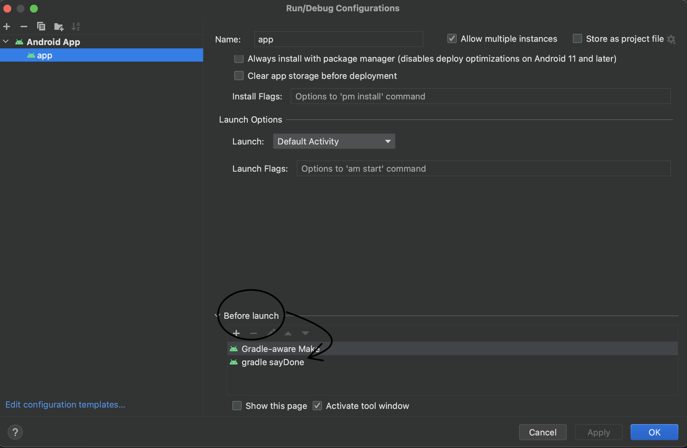

# IlkTurdaBitirelim


This app include gradle task. If you build this app, you can hear the sound.

## Gradle Task Sound
https://user-images.githubusercontent.com/37421570/236877541-46513876-fc11-4e87-b81d-b75328014446.mp4


## How to use gradle task?
Add the following task to root/build.gradle 👇🏻

- `w/KotlinDsl`

```
task("sayDone") {
    doLast {
        exec {
            commandLine("say", "Ilk Turda Bitirelim")
        }
    }
}
```

- `w/Groovy`

```
task sayDone {
    doLast {
        exec {
            commandLine 'say', 'Ilk Turda Bitirelim'
        }
    }
}
```

## Add gradle task to Before Launch in Edit Configuration
<p>
 
</p>


